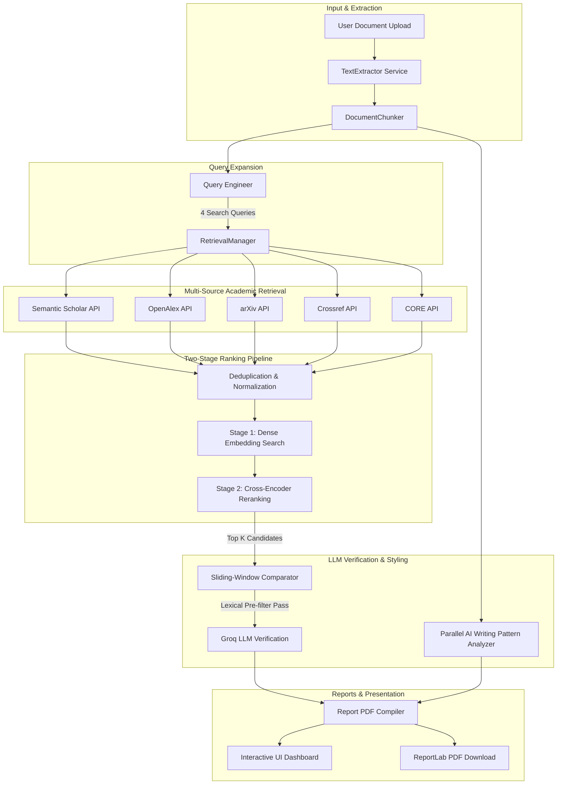

# PlagCheck AI - Complete Technical Architecture & Implementation Report

## 1. Executive Summary

**PlagCheck AI** is a state-of-the-art, retrieval-augmented plagiarism detection and AI writing pattern analysis platform. Unlike traditional plagiarism detectors that rely on heavy local index storage and expensive vector databases, PlagCheck AI operates on a modern **Retrieval-Augmented Generation (RAG)** architecture. It dynamically scans the open academic web, processes extracted texts, uses a two-stage embedding and reranking pipeline, and leverages the Groq Cloud API for segment-level semantic verification.

---

## 2. Technical System Architecture

The application is structured into isolated, asynchronous components that coordinate to perform multi-source extraction, ranking, and validation:

### Component Mapping
| Package/Path | Primary Component | Responsibility |
| :--- | :--- | :--- |
| `app.main` | **FastAPI Application** | Creates the app instance, manages CORS middleware, maps static dashboard files, and handles NLTK download pre-warming lifespans. |
| `app.api.routes` | **APIs & Status Endpoints** | Exposes upload handlers, polling mechanisms, task progress reports, and download controllers. |
| `app.core.config` | **Settings Configuration** | Standardizes config variables, decodes `.env` values, and handles environment setup. |
| `app.services.extraction` | **Document Extractor** | Converts PDF and Word files into clean strings using prioritized library fallbacks (`PyMuPDF`, `pdfplumber`, `python-docx`). |
| `app.services.chunking` | **Sentence Chunker** | Segments files into sentence-aware blocks of 300-500 words with 50-word margins. |
| `app.llm.query_engineer` | **Query Expansion** | Transforms chunks into four specialized queries using Groq to maximize search recall. |
| `app.retrieval.manager` | **Academic Retrieval Coordinator** | Dispatches requests concurrently to 5 APIs, normalizes JSON structures, and filters duplicate papers. |
| `app.embedding.bge_embedder` | **Dense Embeddings** | Computes vector representations using the Hugging Face Inference API with a local TF-IDF fallback. |
| `app.reranking.cross_encoder` | **Abstract Reranker** | Measures deep semantic match scores between chunk texts and reference paper abstracts. |
| `app.services.comparison` | **Sliding-Window Comparator** | Aligns matching candidates to chunks and executes content-word pre-filtering. |
| `app.llm.verifier` | **Segment Verifier** | Queries Groq for sentence-level semantic comparison, exact copying, and rewriting metrics. |
| `app.services.ai_analyzer` | **AI Style Analyzer** | Evaluates predictability, structure homogeneity, and lexical density in parallel threads. |
| `app.services.report` | **PDF Report Engine** | Compiles structured report JSON into custom formatted ReportLab PDF documents. |

---

## 3. The Retrieval-Augmented Generation (RAG) Architecture

### A. Asymmetric Query Engineering
A simple text segment search yields poor recall. To find obscure references, the `QueryEngineer` instructs a fast LLM model to rewrite and expand the text snippet into **four distinct queries** optimized for different databases:
1.  **Keyword Query**: 3-5 high-density technical terms (best for keyword-matched search indexes).
2.  **Semantic Query**: A conceptual, high-level rephrasing (best for dense embedding retrievers).
3.  **Expanded Query**: Primary keywords augmented with academic synonyms.
4.  **Academic Query**: Formally phrased research query statements (best for scholarly search filters).

### B. Multi-Source Concurrent Retrieval
The `RetrievalManager` receives the query bundle and dispatches requests concurrently across:
*   **Semantic Scholar**: Retrieves highly cited computer science and biological papers.
*   **OpenAlex**: Resolves index metadata across millions of scientific records.
*   **arXiv**: Provides instant access to pre-prints and math/physics/CS research.
*   **Crossref**: Matches DOI registries and metadata structures.
*   **CORE**: Indexes open-access scientific publications worldwide.

All responses are deduplicated based on title similarity and normalized into a unified `CandidatePaper` schema containing citation counts, publishing year, and source labels.

### C. Two-Stage Ranking Pipeline
To process the candidates without local database resources, the system implements a two-stage filter:
*   **Stage 1: Semantic Embedding Search**: Chunks and paper metadata are vectorized using `BAAI/bge-small-en-v1.5` embeddings. A cosine-similarity score is calculated to identify top-performing matches.
*   **Stage 2: Cross-Encoder Reranking**: Candidate abstracts and chunk texts are compared using a `cross-encoder/ms-marco-MiniLM-L-6-v2` model. Reranking computes deep cross-attention similarity, bubbling the most structurally similar references to the top.

---

## 4. LLM Plagiarism Verification Engine

### A. Lexical Pre-filtering
To limit API cost and token usage, PlagCheck AI applies a content-word overlap pre-filter. It extracts content words (filtering out common grammatical stop words) from both the chunk and the reference metadata. If the overlap is **less than 3 content words**, the LLM call is bypassed. The chunk is marked **Original**, cutting API token consumption by up to **90%** for non-plagiarized texts.

### B. Sliding-Window Segment Alignment
Instead of running a cartesian-product cross-comparison $O(N \times M)$ of all document segments against candidate papers, the engine executes a sliding-window lookup:
1.  The LLM is prompted with the suspected chunk and candidate abstracts to identify the single most relevant reference source.
2.  Once selected, the comparison is isolated to that specific source, achieving a linear complexity scale of $O(N)$ with respect to document size.

### C. Adaptive Groq Client
The low-level connection layer (`GroqAPIClient`) is designed for maximum reliability:
*   **Global Round-Robin Key Rotation**: An index pointer is maintained as a class-level variable. Each subsequent API request advances this pointer, distributing the call load evenly across all keys to prevent rate limits.
*   **Decommission Safe Model Fallback**: If a model is deprecated or unsupported, the client catches the HTTP 400/404 error, logs a warning, and immediately drops down to the next configured fallback model (e.g. `llama-3.3-70b-versatile` $\rightarrow$ `llama-3.1-8b-instant` $\rightarrow$ `mixtral-8x7b-32768` $\rightarrow$ `gemma2-9b-it`).
*   **Output JSON Constraint**: Explicit prompts forbid wrapping outputs in markdown fences, avoiding `json_validate_failed` parser crashes.

---

## 5. AI Writing Pattern Service

The `AIWritingPatternService` analyzes document segments for the structural signatures of generative AI models:
*   **Parallel Execution**: Checks are processed asynchronously across a multi-threaded worker pool (`ThreadPoolExecutor` with `max_workers = 3`) to prevent blocking the async FastAPI event loop.
*   **Linguistic Signatures**: Computes predictability, structural homogeneity (lack of sentence length and punctuation variety), and lexical density.
*   **Scoring Aggregation**: Metrics are averaged to output an **Overall AI Score (0-100%)** and a categorical classification on the dashboard.

---

## 6. Production & Memory Optimizations (Render Compatibility)

Render's free hosting tier enforces a strict **512MB RAM** ceiling. Loading native PyTorch and Transformers models locally consumes over **1.5GB RAM**, causing immediate Out-Of-Memory (OOM) crashes. PlagCheck AI implements several memory-saving techniques:

1.  **Hugging Face Inference API**: Transitions embedding and cross-encoder workloads to remote Inference API endpoints. Memory usage is reduced to standard HTTP requests, consuming under **150MB RAM** at runtime.
2.  **Lightweight Offline Fallback**: If Hugging Face is unreachable, the system falls back to a lightweight local TF-IDF model and offline signed hashing. This maintains local analysis capabilities without loading heavy neural networks into memory.
3.  **SDK Retry Elimination**: Setting `max_retries=0` in the Groq SDK bypasses internal blocking sleeps on rate-limiting, enabling instantaneous key rotation.
4.  **Lifespan pre-warming**: Standardizes NLTK dataset checks inside FastAPI's startup context manager, avoiding disk-write locks in locked container environments.
