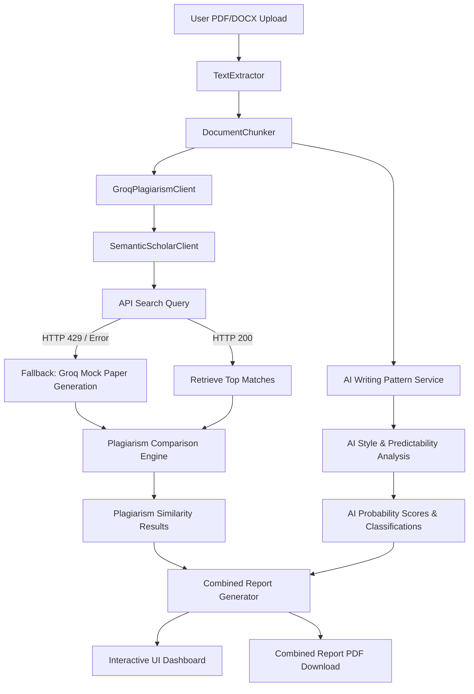

# PlagCheck AI - Complete Project Technical Report

## 1. Executive Summary
**PlagCheck AI** is an enterprise-ready plagiarism detection and AI writing pattern analysis system built with **FastAPI** (Python 3.12) and the **Groq Cloud API**. It performs structural, lexical, and semantic comparison of uploaded documents against literature without vector database overhead.

---

## 2. System Architecture

The codebase is organized into modular services representing the document parsing, comparison, and reporting pipeline:



### Module Descriptions
| Component | File | Primary Responsibility |
| :--- | :--- | :--- |
| **FastAPI Web App** | `app.py` | Exposes REST endpoints, mounts static assets, serves index.html, and implements the server lifespan startup pre-warm handler. |
| **Routes Handler** | `routes.py` | Coordinates asynchronous background jobs, task polling statuses, PDF upload buffering, and report downloads. |
| **Settings Configuration** | `config.py` | Decodes environment variables (`.env`), defines fallback model pipelines, and manages directory initialization. |
| **Text Extractor** | `extractor.py` | Extracts text from `.pdf` and `.docx` files using fallback libraries (`PyMuPDF`, `pdfplumber`, `python-docx`) to guarantee high-fidelity extraction. |
| **Document Chunker** | `chunker.py` | Chunks text into sentence-aware blocks of 300–500 words with 50-word overlaps to preserve structural context across boundary seams. |
| **Groq API Client** | `groq_client.py` | Implements API request wrappers, instant JSON parsing/validation, multi-key rotation, and graceful model fallback. |
| **Plagiarism Comparator** | `comparator.py` | Executes lexical pre-filtering and maps sliding-window text segments against reference papers. |
| **AI Writing Pattern Service** | `ai_analyzer.py` | Runs multi-threaded paragraph-by-paragraph style assessments via a worker pool. |
| **Report Compiler** | `report.py` | Aggregates all JSON outputs and compiles a formatted ReportLab PDF containing metadata tables, chart cards, and side-by-side highlighting. |

---

## 3. Plagiarism Detection Core

### A. Sliding-Window Comparison Engine
To perform semantic comparison, traditional systems run every document chunk against every reference paper chunk, leading to an exponential complexity of $O(N \times M)$ where $N$ and $M$ are the number of chunks.
* **PlagCheck AI** avoids this by using a **sliding window alignment**. It prompts the LLM (`find_best_matching_paper`) to identify which reference paper represents the closest matching context for the entire suspected chunk.
* Once the matching paper is selected, the comparator performs a targeted semantic analysis on the text to evaluate exact copying, paraphrasing, and light rewrites, reducing the complexity to a linear scale of $O(N)$.

### B. Lexical Pre-filtering (New Optimization)
To limit API cost and prevent rate limits, we introduced a pre-filtering layer in `comparator.py`:
1. It extracts unique content words from the suspected chunk (excluding grammatical stop words like *the*, *and*, *is*).
2. It intersects these content words with the reference paper titles and abstracts.
3. If the maximum overlap is **less than 3 content words**, the chunk is determined to have zero plagiarism risk.
4. The system skips the LLM call entirely, sets `semantic_similarity = 0`, and classifies it as **Original**.

```python
# Content-word extraction and stop-word filtering
words = [w.lower() for w in re.findall(r'\b\w{3,}\b', text)]
content_words = {w for w in words if w not in STOP_WORDS}
```

---

## 4. AI Writing Pattern Service

The `AIWritingPatternService` evaluates the writing style of each chunk to detect mechanical generation.

### A. Parallel Processing
Since checking a long document paragraph-by-paragraph requires multiple sequential API queries, doing this on a single thread would block the server. The analyzer implements a `ThreadPoolExecutor`:
* Document analysis runs asynchronously across a worker pool (configured via `max_workers = 3` in production).
* Chunks are evaluated in parallel, accelerating processing speeds.

### B. Linguistic Pattern Scoring
For each block, the system prompts the Groq model to return a structured JSON response evaluating the following linguistic markers:
* **Predictability**: Uniformity of word choices and grammar structures.
* **Lexical Density**: Repetitive use of transition words (*moreover*, *furthermore*, *in conclusion*).
* **Structural Homogeneity**: Lack of sentence length and punctuation variety.
* **Confidence Rating (0–100%)**: The model's self-assessed confidence in the classification.

The scores are averaged across the document to produce an **Overall AI Score** and a classification ranging from *Very Low AI Writing Pattern* to *High AI Writing Pattern*.

---

## 5. API Key Rotation, Model Fallback & Fast Failover

Groq API limits are highly restrictive under free tiers. The system implements a robust, fault-tolerant network layer:

### A. Multi-Key Rotation
You can define multiple keys in `.env` or Render environment settings:
```env
GROQ_API_KEY=gsk_keyA,gsk_keyB,gsk_keyC
```
The initializer in `groq_client.py` splits the string, dedupes the keys, and loads them into an internal array. On an HTTP `429 Too Many Requests` status, the client automatically rotates to the next key.

### B. Graceful Model Fallback
When a model is decommissioned by Groq (such as `gemma2-9b-it`), the API returns an HTTP `400` status. Previously, this would crash the application.
* The system now catches any non-429 `APIStatusError`.
* If it encounters an HTTP `400` or `404` (Model not found/decommissioned), it skips the current model, breaks the key loop for it, and shifts to the next active fallback model:
  1. `llama-3.3-70b-versatile`
  2. `llama-3.1-8b-instant`
  3. `qwen/qwen3-32b`
  4. `qwen/qwen3.6-27b`

### C. Fast Failover (Zero SDK Retries)
By default, the Groq Python SDK wraps requests in its own retry loops with a long exponential sleep (often 50+ seconds) when rate-limited. 
* We set `max_retries=0` in the `Groq` client instances.
* This bypasses the SDK's internal sleep, forcing it to immediately raise the rate limit exception so our client can rotate keys or fall back models instantly.

---

## 6. Production Deployment Setup

The system is configured to run smoothly in a containerized environment (e.g., Render, Railway, Fly.io).

### A. Lifecycle Lifespan Handler
In production, running uvicorn directly bypasses the `if __name__ == "__main__":` block. To prevent NLTK download issues on startup, we added a FastAPI `lifespan` context manager:
```python
@asynccontextmanager
async def lifespan(app: FastAPI):
    from utils import init_nltk
    init_nltk()  # Pre-warm NLTK punkt and punkt_tab
    yield
```

### B. Deployment Parameters
* **Build Command**: `pip install -r requirements.txt`
* **Start Command**: `uvicorn app:app --host 0.0.0.0 --port $PORT`
* **Storage**: Uploads and reports are saved to `uploads/` and `reports/` directories. These utilize local ephemeral storage (automatically cleaned when the server restarts), protecting user privacy.
