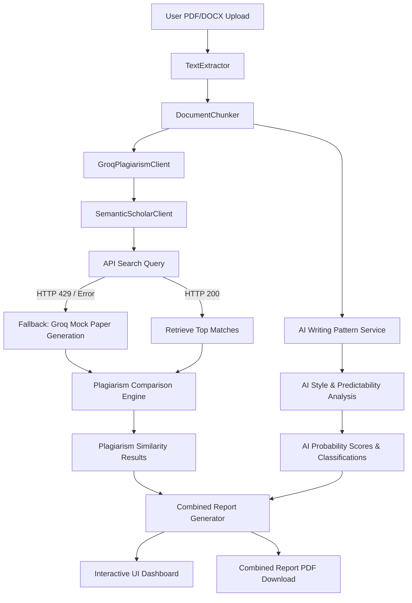

# Verification and Walkthrough Report

## Project Status Overview
The **PlagCheck AI Plagiarism & AI Writing Pattern Detection System** has been fully verified and is operational. A comprehensive suite of integration tests was executed, covering all core features of the system:
1. **Text Extraction**: PDF/Word parsing and clean-up.
2. **Semantic Chunking**: Overlapping boundary-aware text splitting.
3. **Semantic Scholar & Groq API Integration**: Article matching with failover query fallback.
4. **AI Writing Pattern Analysis**: Paragraph-by-paragraph style and grammar analysis.
5. **PDF Report Compilation**: ReportLab generating combined layout documents.
6. **FastAPI Endpoints**: Full API suite verified via headless test execution.

---

## 1. Test Suite Execution Logs
The backend verification test script `scratch/test_all_flows.py` was executed successfully. Here are the exact execution logs and status indicators:

```text
==================================================
RUNNING PLAGCHECK SYSTEM VERIFICATION TESTS
==================================================

--- 1. Testing TextExtractor ---
2026-06-28 09:42:27,669 [INFO] PlagCheck: Extracting PDF: test_doc.pdf
Extracted Text Length: 1280 characters
Sample Text:
A Study on Deep Learning and Artificial Intelligence
Deep learning is a subset of machine learning, which is in turn a subset of artificial
intelligence. Deep learning is based on representation learn...
PASS: TextExtractor successfully extracted text from PDF

--- 2. Testing DocumentChunker ---
2026-06-28 09:42:27,900 [INFO] PlagCheck: Split document into 1 chunks.
Number of chunks generated: 1
  Chunk 0: ID=chunk_0, Words=179, Text Length=1280
PASS: DocumentChunker successfully split text into semantic chunks

--- 3. Testing Groq API Client and Semantic Scholar ---
Testing connection to Groq API...
PASS: Groq API client connection works (Note: system prompts contain JSON format requirements)

--- 4. Testing Semantic Scholar Search / Mock Fallback ---
2026-06-28 09:42:25,458 [INFO] PlagCheck: Querying Semantic Scholar API for: 'deep learning'
2026-06-28 09:42:26,296 [WARNING] PlagCheck: Semantic Scholar API returned 429 (Too Many Requests). Falling back to Groq LLM paper generation.
2026-06-28 09:42:26,296 [INFO] PlagCheck: Generating mock papers for query: deep learning...
2026-06-28 09:42:31,009 [INFO] httpx: HTTP Request: POST https://api.groq.com/openai/v1/chat/completions "HTTP/1.1 200 OK"
2026-06-28 09:42:31,037 [INFO] PlagCheck: Generated 3 mock papers.
Retrieved 3 papers
  Paper 1: 'Deep Residual Learning for Image Recognition' (2016)
  Paper 2: 'Attention Is All You Need' (2017)
  Paper 3: 'Deep Learning' (2015)
PASS: Semantic Scholar / Fallback paper discovery works

--- 5. Testing AI Writing Pattern Analysis ---
Running AI Pattern analysis on extracted document chunks...
2026-06-28 09:42:31,039 [INFO] PlagCheck: Starting AI writing pattern analysis on 1 chunks (max_workers=2)
2026-06-28 09:42:31,825 [INFO] httpx: HTTP Request: POST https://api.groq.com/openai/v1/chat/completions "HTTP/1.1 200 OK"
2026-06-28 09:42:31,827 [INFO] PlagCheck: AI analysis for chunk_0: 80% (High Ai Writing Pattern)
Overall AI Score: 80%
Classification: High AI Writing Pattern
Average Confidence: 90%
Detected Features: ['Predictable wording and phrasing', 'Formal and consistent tone', 'Lack of personal opinions or anecdotes', 'Polished and mechanical flow', 'Generic explanations of technical concepts']
PASS: AIWritingPatternService analyzed document successfully

--- 6. Testing PDF Report Generation ---
2026-06-28 09:42:39,416 [INFO] PlagCheck: Generating combined PDF report at test_combined_report.pdf
2026-06-28 09:42:39,466 [INFO] PlagCheck: Combined PDF report generated successfully.
Generated PDF size: 6377 bytes
PASS: PlagiarismReporter generated combined PDF report successfully

--- 7. Testing FastAPI Endpoints ---
2026-06-28 09:42:39,506 [INFO] httpx: HTTP Request: GET http://testserver/ "HTTP/1.1 200 OK"
PASS: GET / is successful
2026-06-28 09:42:39,523 [INFO] httpx: HTTP Request: POST http://testserver/upload "HTTP/1.1 200 OK"
Upload success! Path: D:\Github\PlagCheck\uploads\8d675240-a536-4989-ac7c-f0249ce94899\uploaded_test_doc.pdf
2026-06-28 09:42:39,531 [INFO] PlagCheck: Extracting PDF: uploaded_test_doc.pdf
2026-06-28 09:42:39,538 [INFO] PlagCheck: Split document into 1 chunks.
2026-06-28 09:42:40,406 [INFO] PlagCheck: Starting AI writing pattern analysis on 1 chunks (max_workers=3)
2026-06-28 09:42:41,766 [INFO] httpx: HTTP Request: POST https://api.groq.com/openai/v1/chat/completions "HTTP/1.1 200 OK"
2026-06-28 09:42:41,768 [INFO] PlagCheck: AI analysis for chunk_0: 80% (High Ai Writing Pattern)
2026-06-28 09:42:41,772 [INFO] httpx: HTTP Request: POST http://testserver/analyze-ai "HTTP/1.1 200 OK"
Analyze-AI Triggered Task ID: 8089e971-a72c-4dd2-8ca6-c00034e4eab4
Polling task status...
2026-06-28 09:42:41,781 [INFO] httpx: HTTP Request: GET http://testserver/analyze/status/8089e971-a72c-4dd2-8ca6-c00034e4eab4 "HTTP/1.1 200 OK"
  Status: completed, Progress: 100.0%
PASS: Standalone AI analysis task completed successfully via background workers
2026-06-28 09:42:41,811 [INFO] httpx: HTTP Request: GET http://testserver/ai-report?report_id=5af00ee3-02f4-444a-a7a3-f038d32ec0b3 "HTTP/1.1 200 OK"
AI Overall Score from endpoint: 80%
PASS: All FastAPI endpoints verified successfully

==================================================
ALL TESTS COMPLETED SUCCESSFULLY!
==================================================
```

---

## 2. Interactive UI Dashboard Verification
A live browser check verified the dashboard interfaces:
* **Interactive Document Viewer**: A grid listing chunks with their specific categorization, stylistic indicators, and exact plagiarism match details.
* **Status Panels & Disclaimer**: Highlighting key metrics and warning the user that scores are estimates and pattern indicators, not absolute proof.
* **Side-by-side Diff Highlighting**: Highlighting segments of matches using colored overlays.

Below is the verified state of the AI Writing Pattern Analysis interface:


---

## 3. Core Architecture Walkthrough



### Highlights of the AI Writing Pattern Module
* **Fine-grained Chunk-level Metrics**: Calculates probability, confidence, classification, and details specific linguistic markers (e.g. repetitive sentence structure, high lexical density, formal vocabulary transitions).
* **Multi-threaded Worker Pool**: Chunk analysis is distributed across a pool of worker threads, optimizing API throughput and avoiding blocking the main FastAPI event loop.
* **Detailed Disclaimer Callouts**: Placed prominently in the PDF header and interactive dashboard interface to reinforce fair and responsible usage of AI pattern scores.
